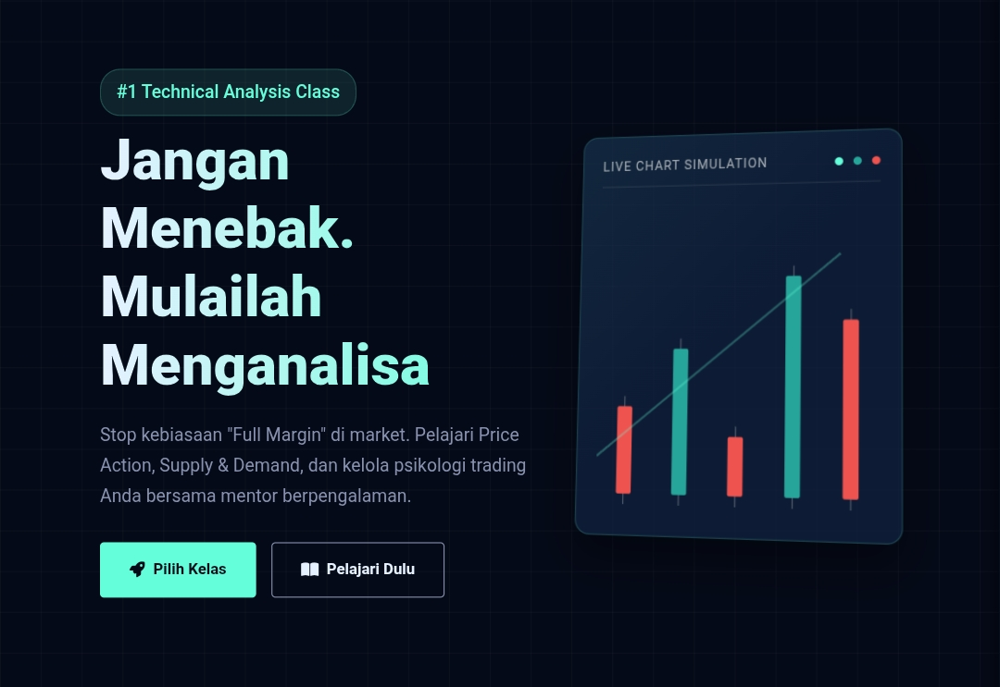

# 📊 OZI FX – Kelas Trading Landing Page

**Deskripsi Singkat:**  
Website ini adalah landing page untuk kelas trading dengan fokus **strategi real-market, analisa teknikal, dan mindset trader profesional**. Dibangun menggunakan HTML, CSS, dan JavaScript agar ringan, cepat, dan 100% responsif.  

> ⚡ Buat trader MC sekalipun, tapi loss bisa dikontrol!

---

## 🖼 Preview Website

  

---

## 💥 Fitur Utama

- **Landing Page Interaktif:** Scroll smooth, mini chart animasi, call-to-action jelas.  
- **Responsif 100%:** Desktop, tablet, dan mobile tampil mulus tanpa kompromi.  
- **Highlight Modul & Kelas:** Kurikulum, testimoni, benefit trading, semuanya tersaji jelas.  
- **Form Pendaftaran Simple & Cepat:** User-friendly, siap integrasi email/CRM.  
- **Fast & Lightweight:** Hanya HTML, CSS, JS—tanpa framework berat.  

---

## 🛠 Teknologi

- **HTML5** – Struktur clean dan semantic.  
- **CSS3** – Flexbox/Grid, animasi, hover effects.  
- **JavaScript (Vanilla JS)** – Animasi, interaktivitas, validasi form.  
- **Vercel** – Hosting cepat, free SSL, auto-deploy dari GitHub.  

